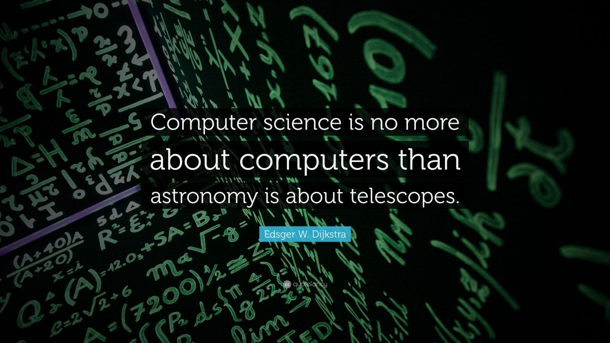

<h1 align="center">Hi 👋, I'm Giulio</h1>
<h3 align="center">A passionate Computer Science Student from Italy 🇮🇹 🇪🇺</h3>

- 🖥️ I’m currently working on:
  - [Web & Service Oriented System](https://github.com/giuliopedicone02/Web-Service-Oriented-System)

- 📝 Other UniCT repositories: 
  -   [Programmazione 1](https://github.com/giuliopedicone02/Programmazione1)
  -   [Programmazione 2](https://github.com/giuliopedicone02/Programmazione2)
  -   [Interazione e Multimedia](https://github.com/giuliopedicone02/Processing)
  -   [Algoritmi](https://github.com/giuliopedicone02/Algoritmi)
  -   [Sistemi Operativi](https://github.com/giuliopedicone02/SistemiOperativi)
  -   [Basi Di Dati](https://github.com/giuliopedicone02/Database)
  -   [Reti di Calcolatori](https://github.com/giuliopedicone02/RetiDiCalcolatori)
  -   [Metodi Matematici e Statistici](https://github.com/giuliopedicone02/Metodi-Matematici-e-Statistici)
  -   [Sistemi Centrali](https://github.com/giuliopedicone02/SistemiCentrali)
  -   [Internet Security](https://github.com/giuliopedicone02/Internet-Security)
  -   [Web Programming Design & Usability](https://github.com/giuliopedicone02/Web-Programming)

- 📚 I’m currently studying **Computer Science (UniCT L-31)**

- 👨‍💻 All of my projects are available at [https://github.com/giuliopedicone02](https://github.com/giuliopedicone02)

- 📫 How to reach me **pediconegiulio02@gmail.com**

<h3 align="left">Connect with me:</h3>

<h3 align="left">Programming Languages:</h3>

<h3 align="left">Web Development:</h3>

<h3 align="left">Other Tools:</h3>

&nbsp;

