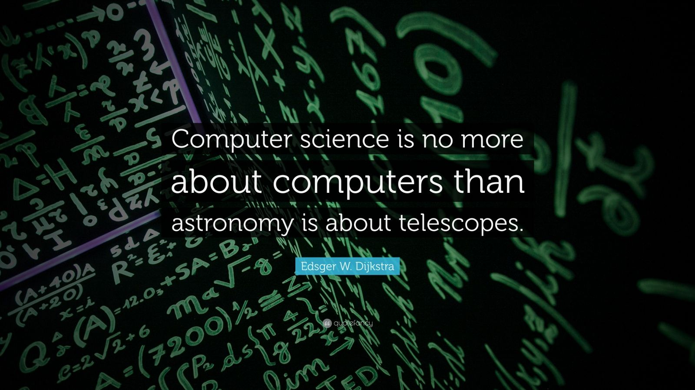

<h1 align="center">Hi 👋, I'm Giulio</h1>
<h3 align="center">A passionate Computer Science Student from Italy 🇮🇹 🇪🇺</h3>
<h4 align="center">📚 MSc Computer Science — LM-18 @ University of Catania</h4>

 

  
  &nbsp;
  
  &nbsp;
  
  &nbsp;
  

---

## 🔦 Currently working on

| Project | Description |
|---|---|
| 🧠 **[Deep Learning](https://github.com/giuliopedicone02/DeepLearning)** | Neural networks, generative models and advanced training techniques |
| 🔍 **[Multimedia Forensics](https://github.com/giuliopedicone02/MultimediaForensics)** | Detection and analysis of manipulations in multimedia content |

---

## 🗝️ UniCT Repositories

| Course | Description |
|---|---|
| 💻 **[Programmazione 1](https://github.com/giuliopedicone02/Programmazione1)** | Fundamentals of programming in C++ |
| 🧩 **[Programmazione 2](https://github.com/giuliopedicone02/Programmazione2)** | Object-oriented programming in C++ |
| 🎨 **[Interazione e Multimedia](https://github.com/giuliopedicone02/Processing)** | Creative coding and multimedia interaction with Processing |
| 📐 **[Algoritmi](https://github.com/giuliopedicone02/Algoritmi)** | Data structures and algorithm design |
| ⚙️ **[Sistemi Operativi](https://github.com/giuliopedicone02/SistemiOperativi)** | Processes, threading, synchronization and memory management in C |
| 🗄️ **[Basi Di Dati](https://github.com/giuliopedicone02/Database)** | Relational database design and SQL queries |
| 🌐 **[Reti di Calcolatori](https://github.com/giuliopedicone02/RetiDiCalcolatori)** | Computer networking concepts and socket programming |
| 📊 **[Metodi Matematici e Statistici](https://github.com/giuliopedicone02/Metodi-Matematici-e-Statistici)** | Mathematical and statistical methods for Computer Science |
| 🖥️ **[Sistemi Centrali](https://github.com/giuliopedicone02/SistemiCentrali)** | Mainframe systems and enterprise computing architectures |
| 🔐 **[Internet Security](https://github.com/giuliopedicone02/Internet-Security)** | Fundamentals of network security |
| 🎯 **[Web Programming Design & Usability](https://github.com/giuliopedicone02/Web-Programming)** | Frontend and backend development, UI/UX principles and usability |
| 🔗 **[Web & Service Oriented System](https://github.com/giuliopedicone02/Web-Service-Oriented-System)** | REST APIs, SOAP services and service-oriented architectures |
| 🤖 **[Machine Learning](https://github.com/giuliopedicone02/MachineLearning)**   &nbsp;&nbsp;&nbsp;↳ 🚦 **[Traffic Sign Detection & Recognition](https://github.com/giuliopedicone02/TrafficSignDetectionAndRecognition)** | Supervised and unsupervised learning algorithms   **Project:** object detection with YOLO |
| 🧬 **[Heuristics & Metaheuristics](https://github.com/giuliopedicone02/Heuristics)** | Genetic algorithms, simulated annealing and swarm intelligence |
| 📈 **[Fondamenti di Analisi Dati](https://github.com/giuliopedicone02/FondamentiDiAnalisiDati)**   &nbsp;&nbsp;&nbsp;↳ 🌍 **[Analysis of UN Country Statistics](https://github.com/giuliopedicone02/Analysis-of-UN-Country-Statistics)** | Data analysis and visualization   **Project:** statistical analysis on UN datasets |
| ☁️ **[Cloud Registry](https://github.com/giuliopedicone02/CloudRegistry)** | Cloud-native application built with AWS, Docker and Terraform |
| 🔔 **[Git Notify Bot](https://github.com/ericad01/GitNotifyBot)** | Telegram bot that monitors GitHub repository events |

---

## 🛠️ Tech Stack

<h4>🖥️ Programming Languages</h4>
<table>
  <tr>
    <td align="center"> C</td>
    <td align="center"> C++</td>
    <td align="center"> Java</td>
    <td align="center"> Python</td>
    <td align="center"> Bash</td>
    <td align="center"> R</td>
    <td align="center"> Processing</td>
  </tr>
</table>

<h4>🌐 Web Development</h4>
<table>
  <tr>
    <td align="center"> HTML</td>
    <td align="center"> CSS</td>
    <td align="center"> JavaScript</td>
    <td align="center"> Node.js</td>
    <td align="center"> PHP</td>
    <td align="center"> Laravel</td>
    <td align="center"> Bootstrap</td>
    <td align="center"> WordPress</td>
  </tr>
</table>

<h4>🤖 AI / Machine Learning</h4>
<table>
  <tr>
    <td align="center"> PyTorch</td>
    <td align="center"> TensorFlow</td>
    <td align="center"> scikit-learn</td>
    <td align="center"> Anaconda</td>
    <td align="center"> NumPy</td>
    <td align="center"> Pandas</td>
    <td align="center"> Matplotlib</td>
    <td align="center"> Jupyter</td>
    <td align="center"> YOLO</td>
  </tr>
</table>

<h4>🗄️ Databases</h4>
<table>
  <tr>
    <td align="center"> MySQL</td>
    <td align="center"> DynamoDB</td>
  </tr>
</table>

<h4>☁️ Cloud, DevOps & Backend</h4>
<table>
  <tr>
    <td align="center"> AWS</td>
    <td align="center"> Terraform</td>
    <td align="center"> Docker</td>
    <td align="center"> Spring Boot</td>
    <td align="center"> Maven</td>
  </tr>
</table>

<h4>🛠️ Tools</h4>
<table>
  <tr>
    <td align="center"> Git</td>
    <td align="center"> GitHub</td>
    <td align="center"> LaTeX</td>
    <td align="center"> VS Code</td>
  </tr>
</table>

---

<h2 align="center">📊 GitHub Stats</h2>

  
  &nbsp;
  

  

  

